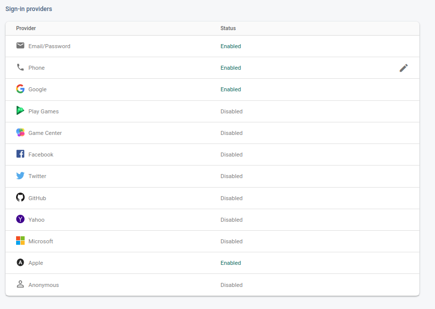

# Configuration & Customization

## Flutter Configuration

**Change App Environment**

```
API_BASE_URL="{URL}"
LARAJET_API_BASE_URL="{URL}"

DEFAULT_DIAL_CODE="+62"

DEFAULT_COUNTRY_CODE="ID"

APP_LOCALE="en"
```


## Firebase Configuration

### Setup Firebase

For Firebase setup, you just need to change the **android/app/google-services.json** file.
Create a new firebase account, register your application with your package name.
Now download the **google-services.json** file and replace with current.
Refer to [Link](https://firebase.google.com/docs/android/setup)


### Create a Firebase project

Before you can add Firebase to your Flutter app, you need to create a Firebase project to connect to your app. Visit [Understand Firebase Projects](https://firebase.google.com/docs/projects/learn-more) to learn more about Firebase projects.


!> **Warning**<br>
If you're releasing your Flutter app on both iOS and Android, register both the iOS and Android versions of your app with the same Firebase project.

Visit for more information on [how to setup for Android](https://firebase.google.com/docs/flutter/setup?platform=android)

Visit for more information on [how to setup for iOS](https://firebase.google.com/docs/flutter/setup?platform=ios)


#### Register your app with Firebase

In the center of the [Firebase console's project](https://console.firebase.google.com/u/0/?pli=1) overview page, click the Android icon to launch the setup workflow.
Enter your app's package name in the Android package name field.

!> **Warning**<br>
Make sure that you enter the ID that your app is actually using. You cannot add or modify this value after you register your app with your Firebase project. Both applicationId should be matched.

Click Register app.


### Add a Firebase configuration file

Click Download **google-services.json** to obtain your Firebase Android config file **google-services.json**.
Move your config file into the **android/app** directory of your Flutter app.
Follow the instruction for enabling Firebase services in your Android app [here](https://firebase.google.com/docs/flutter/setup?platform=android)


### Enable the Google And Phone

In Firebase console, open the Authentication section.
On the Sign-in Method tab, enable the Google Sign method and click save same as Apple and Phone signIn method.
Add your debug and release SHA1 Key. Follow this [link](https://stackoverflow.com/questions/51845559/generate-sha-1-for-flutter-react-native-android-native-app).



### Open Android module in Android Studio

Open Android Studio.
Select Open an existing Android Studio Project.
Open the android directory within your app.
Wait until the project has been synced successfully. (This happens automatically once you open the project, but if it doesn’t, select Sync Project with Gradle Files from the File menu).
Now, click on Run button.


## Android Configuration

!> **Important** <br>
Don't open/change android code inside flutter because flutter doesn't compile android files.
If you want add/change android code, click on
**Tools->Flutter->Open Android module in Android Studio Or File->Open->open** android module inside your project

!> **Important** <br>
Don't change package name inside android/app/src/main/AndroidManifest.xml file


## Change Application Name

You must want to change your application name. This is how you can do. Follow the below step.
Open /android/app/src/main/AndroidManifest.xml and specify your application name.
```
<manifest xmlns:android="http://schemas.android.com/apk/res/android" package="com.example">
                    
    <uses-permission android:name="android.permission.INTERNET"/>
    <uses-permission android:name="android.permission.ACCESS_NETWORK_STATE" />
    <uses-permission android:name="android.permission.CAMERA"/>
    <uses-permission android:name="android.permission.ACCESS_FINE_LOCATION"/>

    <application
        android:label="Flutjet"
        android:name="io.flutter.app.FlutterApplication"
        android:icon="@mipmap/ic_launcher">
<activity>
```


## Change Application Icon

1. Setup the config file
Add your Flutter Launcher Icons configuration to your **pubspec.yaml** or create a new config file called **flutter_launcher_icons.yaml**. An example is shown below. More complex [examples can be found in the example projects.](https://github.com/fluttercommunity/flutter_launcher_icons/tree/master/example)

```
dev_dependencies:
  flutter_launcher_icons: "^0.9.2"

flutter_icons:
  android: "launcher_icon"
  ios: true
  image_path: "assets/icon/icon.png"
```

If you name your configuration file something other than flutter_launcher_icons.yaml or pubspec.yaml you will need to specify the name of the file when running the package.

```
flutter pub get
```
```
flutter pub run flutter_launcher_icons:main -f <your config file name here>
```

?> Note: If you are not using the existing pubspec.yaml ensure that your config file is located in the same directory as it.

<br>
2. Run the package
After setting up the configuration, all that is left to do is run the package.

```
flutter pub get
```
```
flutter pub run flutter_launcher_icons:main
```


## Change App Package Name

Add Change App Package Name to your pubspec.yaml in dev_dependencies: section.

```
dev_dependencies: 
  change_app_package_name: ^1.1.0
```

Not migrated to null safety yet? use old version like this

```
dev_dependencies: 
  change_app_package_name: ^0.1.3
```

Update dependencies
```
flutter pub get
```
Run this command to change the package name.
```
flutter pub run change_app_package_name:main com.new.package.name
```
Where ```com.new.package.name``` is the new package name that you want for your app. replace it with any name you want.