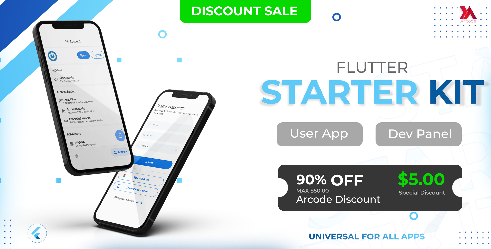
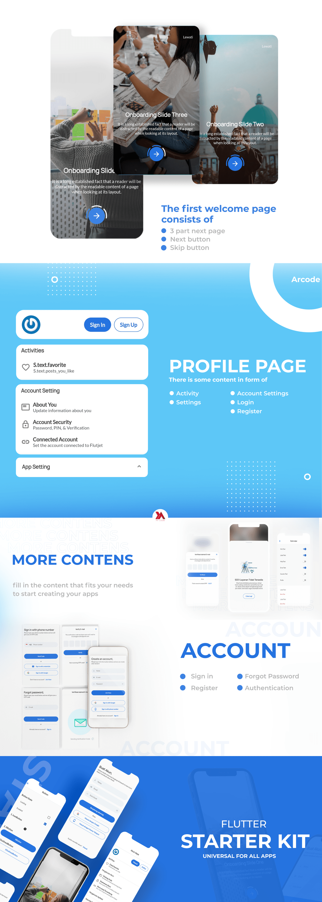

# Flutjet

Flutjet is a beautifully designed application starter kit for Flutter and provides the perfect starting point for your next Flutter application. Flutjet provides the implementation for your application's login, registration, account management & much more. See Example [API Documentations](http://103.82.243.88/docs)

<a target=blank href="#"><button type="button" class="btn btn-primary">Download Flutjet</button></a>
  

   

#### DEMO MOBILE APP

Email: user@gmail.com  
Password: user@gmail.com

<a target=blank href="https://www.mediafire.com/file/e5tk3ju339bkbm4/flutjet-demo.apk/file"><button type="button" class="btn btn-primary">Download APK</button></a>
 

